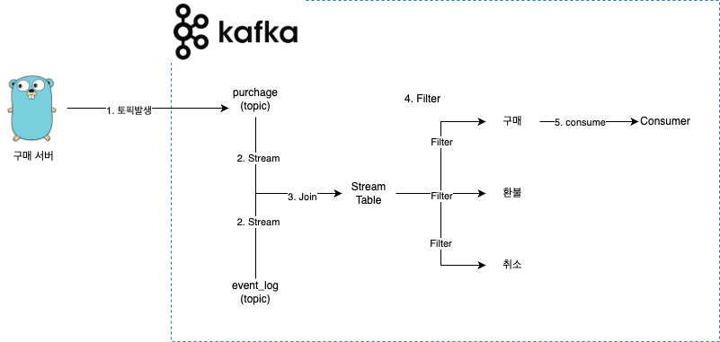

# CDC / Stream Configuration


## MYSQL Example Table

```sh
CREATE TABLE users (
    id INT NOT NULL AUTO_INCREMENT,
    email VARCHAR(255) NOT NULL,
    password VARCHAR(255) NOT NULL,
    created_at TIMESTAMP NOT NULL DEFAULT CURRENT_TIMESTAMP,
    updated_at TIMESTAMP NOT NULL DEFAULT CURRENT_TIMESTAMP ON UPDATE CURRENT_TIMESTAMP,
    deleted_at TIMESTAMP NULL DEFAULT NULL,
    PRIMARY KEY (id),
    INDEX idx_email (email)
	) ENGINE=InnoDB DEFAULT CHARSET=utf8mb4 COLLATE=utf8mb4_unicode_ci;

	CREATE TABLE users_outbox (
    id INT NOT NULL AUTO_INCREMENT,
		event_type VARCHAR(255) NOT NULL,
    email VARCHAR(255) NOT NULL,
    password VARCHAR(255) NOT NULL,
    created_at TIMESTAMP NOT NULL DEFAULT CURRENT_TIMESTAMP,
    updated_at TIMESTAMP NOT NULL DEFAULT CURRENT_TIMESTAMP ON UPDATE CURRENT_TIMESTAMP,
    deleted_at TIMESTAMP NULL DEFAULT NULL,
    PRIMARY KEY (id),
    INDEX idx_email (email)
	) ENGINE=InnoDB DEFAULT CHARSET=utf8mb4 COLLATE=utf8mb4_unicode_ci;

CREATE TABLE frontend (
    id INT NOT NULL AUTO_INCREMENT,
		event_type VARCHAR(255) NOT NULL,
    email VARCHAR(255) NOT NULL,
    password VARCHAR(255) NOT NULL,
    created_at TIMESTAMP NOT NULL DEFAULT CURRENT_TIMESTAMP,
    updated_at TIMESTAMP NOT NULL DEFAULT CURRENT_TIMESTAMP ON UPDATE CURRENT_TIMESTAMP,
    deleted_at TIMESTAMP NULL DEFAULT NULL,
    PRIMARY KEY (id),
    INDEX idx_email (email)
	) ENGINE=InnoDB DEFAULT CHARSET=utf8mb4 COLLATE=utf8mb4_unicode_ci;

CREATE TABLE backend (
    id INT NOT NULL AUTO_INCREMENT,
		event_type VARCHAR(255) NOT NULL,
    email VARCHAR(255) NOT NULL,
    password VARCHAR(255) NOT NULL,
    created_at TIMESTAMP NOT NULL DEFAULT CURRENT_TIMESTAMP,
    updated_at TIMESTAMP NOT NULL DEFAULT CURRENT_TIMESTAMP ON UPDATE CURRENT_TIMESTAMP,
    deleted_at TIMESTAMP NULL DEFAULT NULL,
    PRIMARY KEY (id),
    INDEX idx_email (email)
	) ENGINE=InnoDB DEFAULT CHARSET=utf8mb4 COLLATE=utf8mb4_unicode_ci;

CREATE TABLE devops (
    id INT NOT NULL AUTO_INCREMENT,
		event_type VARCHAR(255) NOT NULL,
    email VARCHAR(255) NOT NULL,
    password VARCHAR(255) NOT NULL,
    created_at TIMESTAMP NOT NULL DEFAULT CURRENT_TIMESTAMP,
    updated_at TIMESTAMP NOT NULL DEFAULT CURRENT_TIMESTAMP ON UPDATE CURRENT_TIMESTAMP,
    deleted_at TIMESTAMP NULL DEFAULT NULL,
    PRIMARY KEY (id),
    INDEX idx_email (email)
	) ENGINE=InnoDB DEFAULT CHARSET=utf8mb4 COLLATE=utf8mb4_unicode_ci;
```

## Connector 구성

### Command

```sh
curl -X POST http://localhost:8083/connectors \
    -H "Content-Type: application/json" \
    -d @connector/mysql-source-connector.json

# 모든 커넥터 리스트 조회
curl -X GET http://localhost:8083/connectors

# 특정 커넥터 상세 정보 조회
curl -X GET http://localhost:8083/connectors/mysql-source-connector

# 특정 커넥터의 설정 정보 조회
curl -X GET http://localhost:8083/connectors/mysql-source-connector/config
```

### users_outbox 테이블 Source Connector

- users_outbox에 (INSERT, UPDATE, DELETE) 이벤트 발생 시 카프카 users.users_outbox 토픽으로 이벤트 전달

```json
{
  "name": "mysql-source-connector",
  "config": {
    "connector.class": "io.debezium.connector.mysql.MySqlConnector",
    "database.hostname": "mysql",
    "database.port": "3306",
    "database.user": "dobby",
    "database.password": "1234",
    "database.server.id": "1",
    "database.server.name": "users",
    "database.include.list": "users",
    "table.include.list": "users.users_outbox",
    "database.history.kafka.bootstrap.servers": "kafka:9092",
    "database.history.kafka.topic": "schema-changes.users",
    "key.converter": "org.apache.kafka.connect.json.JsonConverter",
    "value.converter": "org.apache.kafka.connect.json.JsonConverter",
    "key.converter.schemas.enable": "false",
    "value.converter.schemas.enable": "false",
    "include.schema.changes": "true",
    "snapshot.mode": "initial"
  }
}
```



- 음악, 영상등이 실시간으로 송출되어 컨텐츠를 구성할때 사용
- 컨텐츠 송출 시 컨텐츠 송출 서버에서 컨텐츠 송출 이벤트를 카프카 토픽으로 전달
- 컨텐츠 송출 서버에서 컨텐츠 송출 이벤트를 카프카 토픽으로 전달

## Kafka Schema Registry

## 참고

- <a href="https://www.confluent.io/product/connectors/"> Kafka Connectors </a>
