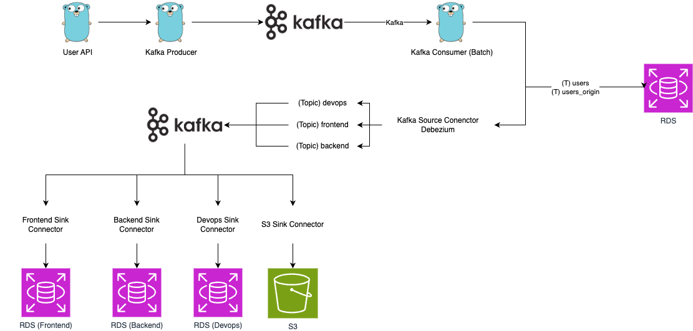

# CDC Configuration



## MYSQL Example Table

```sh
CREATE TABLE users (
    id INT NOT NULL AUTO_INCREMENT,
    email VARCHAR(255) NOT NULL,
    password VARCHAR(255) NOT NULL,
    created_at TIMESTAMP NOT NULL DEFAULT CURRENT_TIMESTAMP,
    updated_at TIMESTAMP NOT NULL DEFAULT CURRENT_TIMESTAMP ON UPDATE CURRENT_TIMESTAMP,
    deleted_at TIMESTAMP NULL DEFAULT NULL,
    PRIMARY KEY (id),
    INDEX idx_email (email)
	) ENGINE=InnoDB DEFAULT CHARSET=utf8mb4 COLLATE=utf8mb4_unicode_ci;

	CREATE TABLE users_outbox (
    id INT NOT NULL AUTO_INCREMENT,
		event_type VARCHAR(255) NOT NULL,
    email VARCHAR(255) NOT NULL,
    password VARCHAR(255) NOT NULL,
    created_at TIMESTAMP NOT NULL DEFAULT CURRENT_TIMESTAMP,
    updated_at TIMESTAMP NOT NULL DEFAULT CURRENT_TIMESTAMP ON UPDATE CURRENT_TIMESTAMP,
    deleted_at TIMESTAMP NULL DEFAULT NULL,
    PRIMARY KEY (id),
    INDEX idx_email (email)
	) ENGINE=InnoDB DEFAULT CHARSET=utf8mb4 COLLATE=utf8mb4_unicode_ci;

	CREATE TABLE frontend (
    id INT NOT NULL AUTO_INCREMENT,
		event_type VARCHAR(255) NOT NULL,
    email VARCHAR(255) NOT NULL,
    password VARCHAR(255) NOT NULL,
    created_at TIMESTAMP NOT NULL DEFAULT CURRENT_TIMESTAMP,
    updated_at TIMESTAMP NOT NULL DEFAULT CURRENT_TIMESTAMP ON UPDATE CURRENT_TIMESTAMP,
    deleted_at TIMESTAMP NULL DEFAULT NULL,
    PRIMARY KEY (id),
    INDEX idx_email (email)
	) ENGINE=InnoDB DEFAULT CHARSET=utf8mb4 COLLATE=utf8mb4_unicode_ci;

	CREATE TABLE backend (
    id INT NOT NULL AUTO_INCREMENT,
		event_type VARCHAR(255) NOT NULL,
    email VARCHAR(255) NOT NULL,
    password VARCHAR(255) NOT NULL,
    created_at TIMESTAMP NOT NULL DEFAULT CURRENT_TIMESTAMP,
    updated_at TIMESTAMP NOT NULL DEFAULT CURRENT_TIMESTAMP ON UPDATE CURRENT_TIMESTAMP,
    deleted_at TIMESTAMP NULL DEFAULT NULL,
    PRIMARY KEY (id),
    INDEX idx_email (email)
	) ENGINE=InnoDB DEFAULT CHARSET=utf8mb4 COLLATE=utf8mb4_unicode_ci;

	CREATE TABLE devops (
    id INT NOT NULL AUTO_INCREMENT,
		event_type VARCHAR(255) NOT NULL,
    email VARCHAR(255) NOT NULL,
    password VARCHAR(255) NOT NULL,
    created_at TIMESTAMP NOT NULL DEFAULT CURRENT_TIMESTAMP,
    updated_at TIMESTAMP NOT NULL DEFAULT CURRENT_TIMESTAMP ON UPDATE CURRENT_TIMESTAMP,
    deleted_at TIMESTAMP NULL DEFAULT NULL,
    PRIMARY KEY (id),
    INDEX idx_email (email)
	) ENGINE=InnoDB DEFAULT CHARSET=utf8mb4 COLLATE=utf8mb4_unicode_ci;
```

## Connector 구성

```sh
curl -X POST http://localhost:8083/connectors \
    -H "Content-Type: application/json" \
    -d @connector/mysql-source-connector.json

# 모든 커넥터 리스트 조회
curl -X GET http://localhost:8083/connectors

# 특정 커넥터 상세 정보 조회
curl -X GET http://localhost:8083/connectors/mysql-source-connector

# 특정 커넥터의 설정 정보 조회
curl -X GET http://localhost:8083/connectors/mysql-source-connector/config
```
